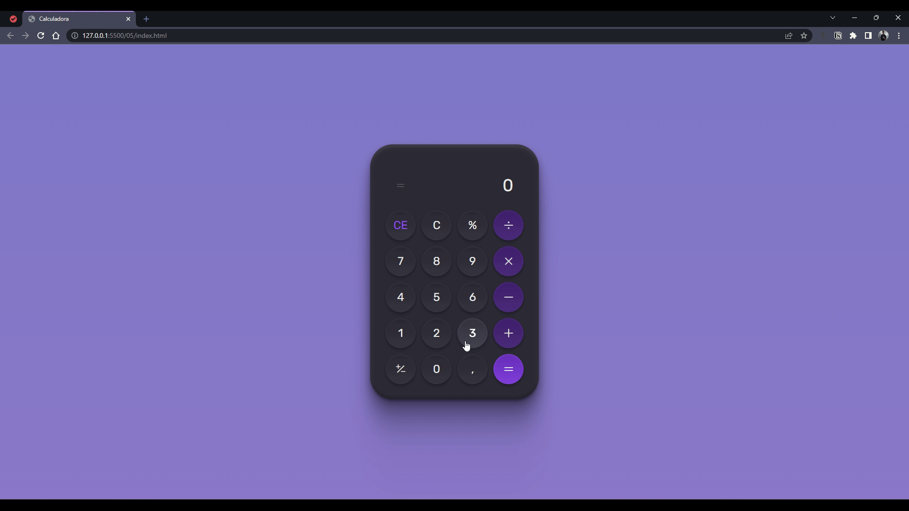

<h1 align="center">Calculadora</h1>

Desafio #05

  <a href="#-tecnologias">Tecnologias</a>&nbsp;&nbsp;&nbsp;|&nbsp;&nbsp;&nbsp;
  <a href="#-projeto">Projeto</a>&nbsp;&nbsp;&nbsp;|&nbsp;&nbsp;&nbsp;
  <a href="#autor">Autor</a>

 

  

## 💻 Projeto

Olá, essa é a minha versão do desafio 05 do [#boraCodar](https://boracodar.dev/) oferecido pela [Rocketseat](https://www.rocketseat.com.br/).

Foi muito interessante desenvolver este projeto que conta com um design bem sofisticado e elegante.

Além de desenvolver todo o Frontend, aproveitei para tornar o projeto funcional e dar possibilidades para o usuário de utilizar o mouse ou o próprio teclado para realizar os cálculos.

Eu poderia simplesmente sair "cuspindo" código no editor por parecer um projeto simples, porém eu resolvi ir um pouco além e separar um pouco as responsabilidades trabalhando melhor a arquitetura do projeto. Tive alguns desafios bem interessantes no meio do caminho, mas gostei muito do resultado final. 😍🚀

## 🚀 Tecnologias

Esse projeto foi desenvolvido com as seguintes tecnologias:

- HTML
- CSS
- JavaScript

## Autor

 

Feito com 💜 por Jordane Chaves
