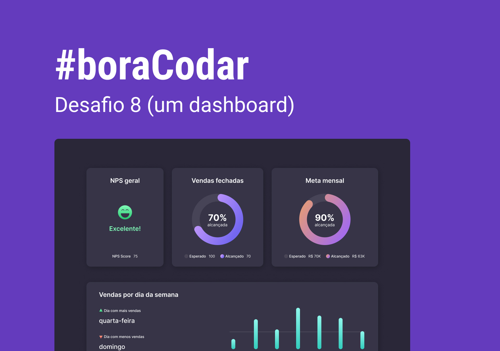

<h1 align="center">Dashboard</h1>

<p align="center">
#boraCodar são desafios semanais, promovido pela Rocketseat para ensino de tecnologias WEB. <br/>
</p>

<p align="center">
  <a href="#-tecnologias">Tecnologias</a>&nbsp;&nbsp;&nbsp;|&nbsp;&nbsp;&nbsp;
  <a href="#-layout">Layout</a>&nbsp;&nbsp;&nbsp;|&nbsp;&nbsp;&nbsp;
  <a href="#memo-licença">Licença</a>
</p>

<p align="center">
  
</p>

<br>

<p align="center">
  
</p>

## 🚀 Tecnologias

Esse projeto foi desenvolvido com as seguintes tecnologias:

- HTML, CSS e SVG
- Figma
- https://bennettfeely.com/clippy/

## 📚 O que aprendemos nesse desafio

```md
# CSS

- aplicar variável pelo atributo HTML
- animations / @keyframes
- column-gap / row-gap
- grid-template-columns / grid-template-rows / grid-column / grid-auto-flow
- fit-content
- margin-top: auto
- place-content / align-self / justify-items / justify-content
- centralizar div com position/grid/flex/margin
- :nth-child() / ::before
- transform / matrix() / rotate()
- stroke / dasharray / dashoffset / stroke-width / linecap
- fill
- responsividade / mobile first / @media
- clip-path / polygon
- linear-gradient()
- calc()

# SVG

- viewBox
- circle
- cx / cy
- r
- stroke
- defs
- linearGradient
```

## 🔖 Layout

Você pode visualizar o layout do projeto através [DESSE LINK](https://www.figma.com/community/file/1210217615683203825). É necessário ter conta no [Figma](https://figma.com) para acessá-lo.

## :memo: Licença

Esse projeto está sob a licença MIT.

## Autor


<br />

Feito com 💜 por Jordane Chaves
