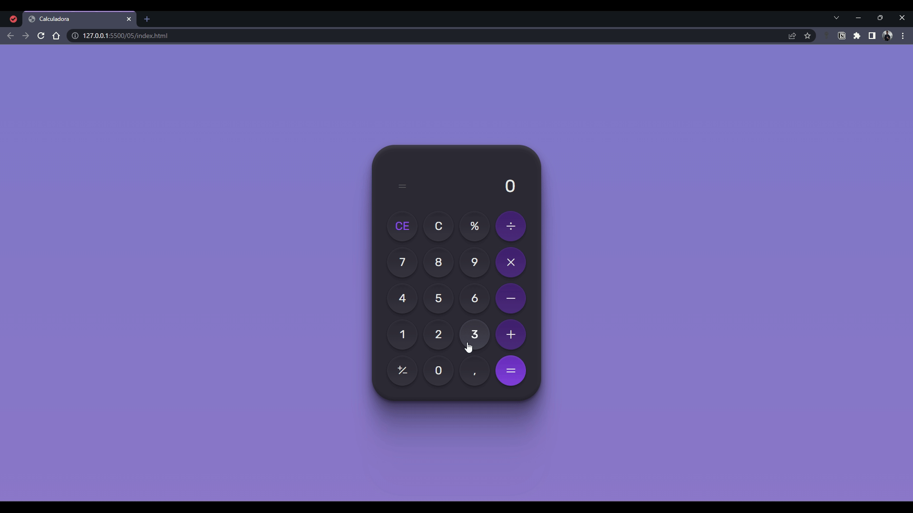

<h1 align="center">#boraCodar</h1>

  #boraCodar são desafios semanais, promovido pela Rocketseat para ensino de tecnologias WEB.
   
  <a href="https://boracodar.dev">
    Acesse o desafio desta semana clicando aqui
  </a>
   
   
  
   
   
  <table>
    <thead>
        <tr>
            <th align="center">
                
                

                    <small>#</small>
                

            </th>
            <th align="center">
                
                

                    <small>
                        NAME
                    </small>
                

            </th>
            <th align="left">
                
                

                    <small>
                    RELEASE DATE
                    </small>
                

            </th>
            <th align="center">
                
                

                    <small>
                    PREVIEW
                    </small>
                

            </th>
        </tr>
    </thead>
    <tbody>
        <tr>
            <td>05</td>
            <td><a href="05">Calculadora</a></td>
            <td>06/02/23</td>
            <td align="center"></td>
        </tr>
        <tr>
            <td>06</td>
            <td><a href="06">Cartão de embarque</a></td>
            <td>09/02/23</td>
            <td align="center" ></td>
        </tr>
        <tr>
            <td>07</td>
            <td><a href="07">Site para encontrar seu bloco no carnaval</a></td>
            <td>22/02/23</td>
            <td align="center" ></td>
        </tr>
    </tbody>
  </table>

 

## 📝 Licença

Esses projetos estão sob a licença MIT.

## Autor

 

Feito com 💜 por Jordane Chaves
